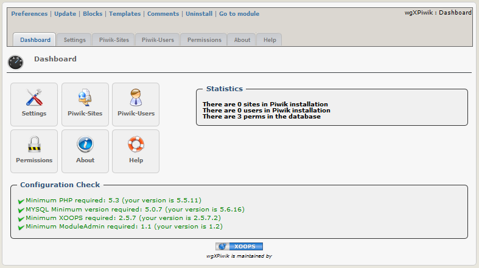

### _XOOPS Documentation Series_

# Module wgXPiwik
#### Version: 1.02
#### for XOOPS 2.5.7
      

            
## User Manual

© 2014 The XOOPS Project (www.xoops.org)    

## Module Purpose 

This module is for implementation of Piwik to your Xoops.

You can provide the statistical informations/widgets of Piwik also on user side, so your website clients do not need knowlegde about Piwik and they do not need a login account.

For detailed information about Piwik and widgets of Piwik goto http://piwik.org/

 
*Figure 1: Main view of the wgxPiwik Module (Admin side)*

# Table of Content

* [Install/Uninstall](en/book/1install.md)
* [Administration Menu](en/book/2administration.md)
* [Preferences](en/book/3preferences.md)
* [Operating Instructions](en/book/4operations.md)
* [The User Side](en/book/5userside.md)
* [Blocks](en/book/6blocks.md)
* [Templates](en/book/7templates.md)
* [Module Credits](en/book/9credits.md)

##License:

 Unless specified, this content is licensed under a <a rel="license" href="http://creativecommons.org/licenses/by-nc-sa/4.0/">Creative Commons Attribution-NonCommercial-ShareAlike 4.0 International License</a>.

All derivative works are to be attributed to XOOPS Project (www.xoops.org)
