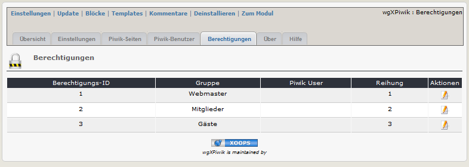
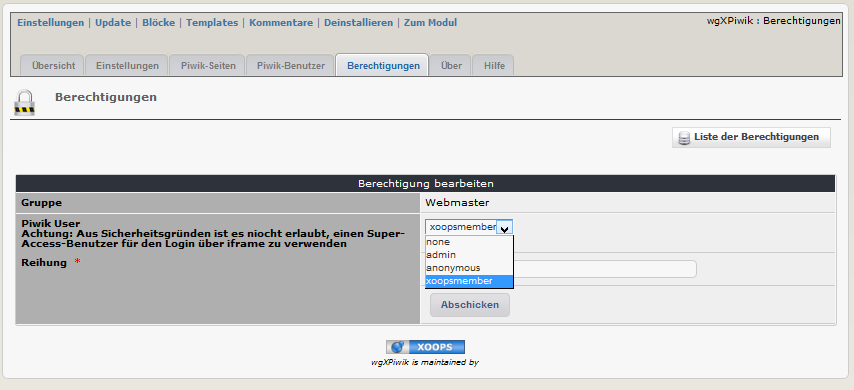
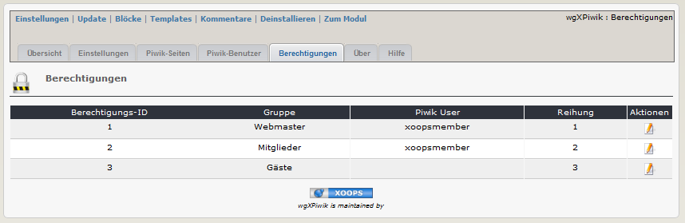

# 2.4 Berechtigungen
Um Piwik in einem iframe auf der Benutzerseite verwenden zu können, müssen sie in Piwik einen Standarduser anlegen, da es aus Sicherheitsgründen nicht zulässing ist, sich im iframe als Super-Acces-User (=Administrator) einzuloggen.
Für weitere Informationen siehe auch [4. Bedienungsanleitung](4operations.md)

#### 2.4.1 Berechtigungen auflisten
Auf den Registerblatt 'Berechtigungen' sehen sie eine Liste der aktuellen Xoops-Gruppen. Sobald sie dieses Registerblatt aufrufen, erfolgt ein Abgleich mit den bestehenden Gruppen (neue Gruppen werden hinzugefügt, mittlerweile gelöschte Gruppen werden weider entfernt).

#### 2.4.2 Hinzufügen/Bearbeiten von Berechtigungen

#### Piwik User
Wählen sie einen Piwik-Benutzer, dem das Recht 'Ansicht' zugeordnet wurde (für weitere Informationen siehe auch [4. Bedienungsanleitung](4operations.md))
 >**Achtung**: Aus Sicherheitsgründen ist es niocht erlaubt, einen Super-Access-Benutzer für den Login über iframe zu verwendenfor security reason it is not allowed to select a super access user for log in via iframe

#### Weight
You can define the ranking of the permissions for users, which are members of different groups.

2.4.3 Final permissions settings (example)

