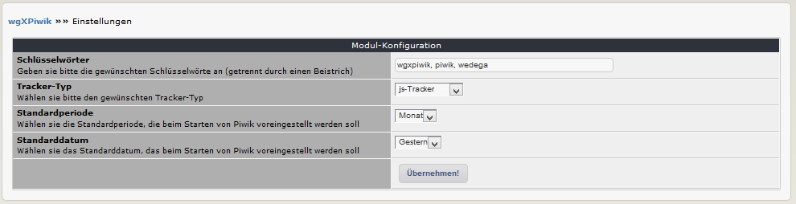

# 3. Einstellungen

In den Moduleinstellungen können Sie verschiedene Optionen festlegen: 

## 3.1 Optionen im Detail
#### Schlüsselwörter
Bitte hier die gewünschten Schlüsselwörter eingeben (getrennt durch einen Beistrich), welche dann in den Metatags verwendet werden.

#### Tracker-Typ
Definieren Sie die Anzahl der Einträge in Listen im Adminbereich.
