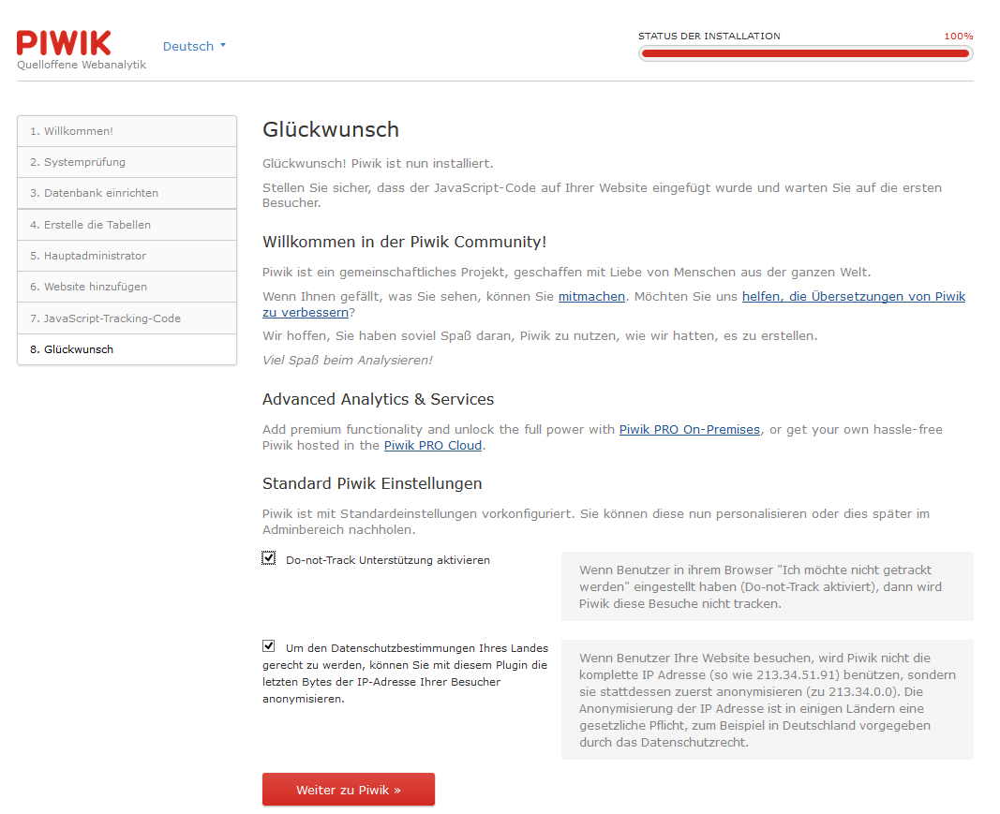

# 4.0 Bedienungshinweise

Um dieses Modul verwenden zu können, müssen sie folgenden ausführen:
1. Installieren sie das Modul
2. Gehen sie zum Modul wgXPiwik > Einstellungen

3. Klicken sie4 auf "Installieren" und installieren sie Piwik

Führen sie den gesamten Installationsprozess von Piwik aus

4. Nach der erfolgreichen Installation von Piwik müssen sie noch die erforderlichen Einstellung in Piwik vornehmen. Um Piwik in einem iframe auf der Benutzerseite verwenden zu können, müssen sie in Piwik einen Standarduser anlegen, da es aus Sicherheitsgründen nicht zulässing ist, sich im iframe mit Super-Acces-Rechten (=Administrator) einzuloggen.
Für weitere Informationen siehe auch [4. Bedienungsanleitung](4operations.md)
5. Melden sie sich mit dem gerade erstellen Admin-Konto bei Piwik an.

Gehen sie zur Administration 

a) goto Users
b) add a new user (in my example I named him "xoopsmember"
c) set right "view" to enabled

5. Go back to module admin area of wgXPiwik
6. Do the necessary module and block settings (see also [2.2 Settings](2admin_settings.md)) and create the the permissions for the xoops usergroups (see also [2.4 Permissions](2admin_permissions.md))
7. Adopt your Piwik on user side (add/remove wigdets) as you want (see also [5. User side](5userside.md))
8. For detailed information about Piwik and widgets of Piwik goto http://piwik.org/

