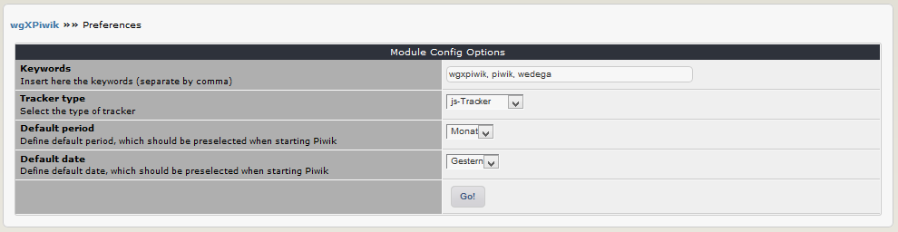

# 3. Preferences

In the module preferences you can set various options for this module: 

## 3.1 Options in detail
#### Keywords
You can add keywords, which are added to the meta tags. Seperate the keywords by comma.

#### Tracker type
Please decide, which tracker type you want use:
* js-Tracker
* Tracker image

